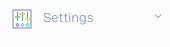
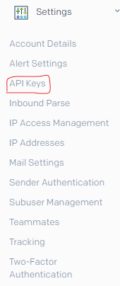
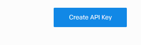
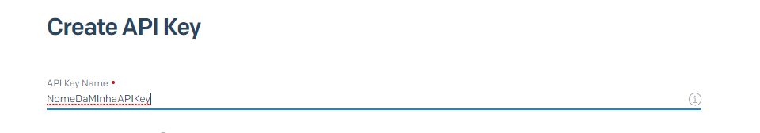
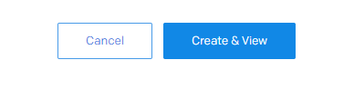
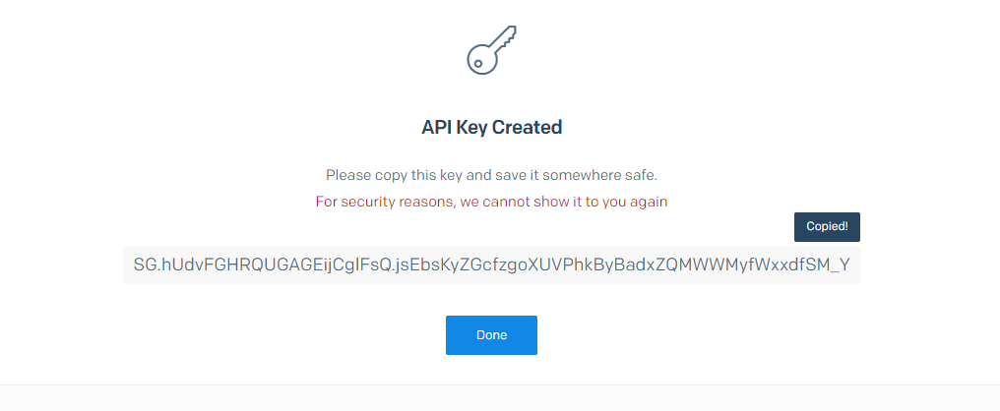
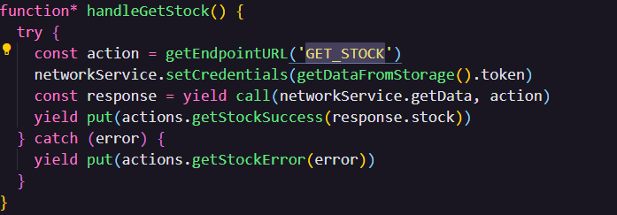
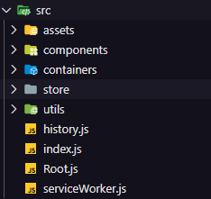
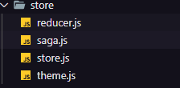
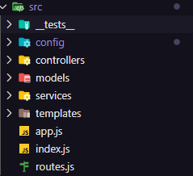

# Template Autenticação JS

Esse template tem as funcionalidades básicas de autenticação para você usar como base para construir os seus futuros projetos. Usando o Javascript como base tanto para o back-end como para o front-end.

## Tecnologias

Back-end: [NodeJs](https://nodejs.org/), [ExpressJs](https://expressjs.com/), [PassportJs](http://www.passportjs.org/), [SendGrid](https://sendgrid.com/docs/), [MongoDB](https://www.mongodb.com/), [Mongoose](https://mongoosejs.com/).

Front-end: [ReactJs](https://reactjs.org/), [Material UI](https://material-ui.com/), [Redux](https://redux.js.org/), [Redux Saga](https://redux-saga.js.org/), [Redux Form](https://redux-form.com).

Ambiente: [Docker](https://www.docker.com/)

## Dependências

É necessário ter Node e o Docker instalado na sua máquina. Criar um cluster usando [Mongo Atlas](https://www.mongodb.com/cloud/atlas), ou adicionar um serviço que rode o MongoDB localmente ou adicionar um serviço usando o docker para rodar uma instancia do MongoDB. Sendo a primeira opção mais fácil e recomentada para iniciar o projeto.

É necessário criar uma conta no SendGrid e gerar uma API KEY, após criar uma conta vá na aba settings ou definições:



Clique em API KEYS ou Chaves API:



Clique no botão Create API Key ou Criar Chave API:



Crie um nova para sua chave API:



Clique em Create&View ou Criar&Visualizar:



Copie a API Key gerada e salve em um lugar seguro será usada para preencher o .env e não será possível visualizar essa chave novamente depois de criada pelo SendGrid.



Não se esqueça de verificar o seu email e se possível cadastrar um sender.

## Primeiros Passos

Após ter as dependências instaladas você precisa criar um arquivo .env no mesmo nível do arquivo docker-compose.yml, ou seja, no root do projeto com as seguintes variáveis.

```bash
WEB_URL=http://localhost:3000
MONGO_URI=Coloque aqui o seu mongo uri
DB_NAME=auth
EMAIL=Email que criou conta no sendgrid
SEND_GRID_API_KEY=Sua api key gerada pelo sendgrid
JWT_SECRET=uyrxvzhjnkgvwd23wasd2quaisdozjn2qwdasxz
COMPANY_NAME=O nome do seu site
FACEBOOK_URL=https://pt-br.facebook.com/
CENTRAL_AJUDA_URL=https://pt-br.facebook.com/
```

Após a configuração do arquivo .env basta rodar o seguinte comando

```bash
docker-compose up
```

A primeira vez será um pouco mais lenta mas as próximas serão mais rápidas. Parabéns a esse ponto o seu template já deve estar rodando com sucesso. Qualquer problemas para inicializar o template entre em contato conosco. Ajuda personalizada por Team Viewer serão cobradas a parte.

## Detalhes do Projeto

Em uma visão mais macro de como o projeto funciona de uma forma mais simplificada temos 3 serviços rodando no docker o nginx que faz o papel de proxy e redireciona todas as requisições que iniciam com "/api" para o servidor e todas as outras são direcionadas para o serviço web.

Esse template usa a abordagem de autenticação via Json Web Token, ou JWT, para autenticar os usuários, portanto sempre que fizer uma requisição para uma rota protegida deve adicionar o token no header da requisição.

Tanto no back-end quanto no front-end o prettier já esta configurado para rodar ele basta entra na pasta web ou server e rodar o seguinte comando:

```bash
npm run format
```

No front-end o eslint já esta configurado basta rodar o seguinte o seguinte comando:

```bash
npm run lint
```



A aplicação web é dividida em containers que agrupam a lógica de uma determinada página ou funcionalidade. Sendo a ideia é manter a lógica de uma mesma funcionalidade concentrada em um container. A estrutura da pasta "src" é a seguinte:



Os containers são divididos em duas pastas principais a pasta meta que cuida de toda a lógica relacionada ao container como os reducers e os arquivos saga do container e a parta componentes que é onde fica a parte visual do container e os styles relacionados ao container.

Para criar um container básico basta rodar os seguinte código:

```bash
npm run generate:container
```

A primeira pergunta será o nome do container.

A segunda pergunta será sobre se quer ter as actions e os reducers com um modelo básico.

A terceira se quer ter um sufixo de Page se não quiser será adicionado o sufixo de Container.

Sendo a pasta "assets" destinada a guardar os arquivos estáticos como imagems e animações. A pasta "components" tem como objetivos armazenar todos os componentes mais genéricos que vão ser usados várias vezes na sua aplicação. A pasta "store" armazena os estados globais da sua aplicação tanto dos reducers, do tema da aplicação e do redux saga, se criar uma nova função que utilize o estado e ela parece não responder certifique-se de que o reducer e o saga criado estão conectados na store. Se está utilizando o redux form não existe essa necessidade mas para cada saga novo criado se faz necessário sua ligação com a store central.



No reducer.js você conecta seus novos reducers, e no saga.js você conecta suas novas sagas. O store.js foi configurado para permitir a visualização da sua store pela extenção [Redux DevTools](https://chrome.google.com/webstore/detail/redux-devtools/lmhkpmbekcpmknklioeibfkpmmfibljd).

O arquivo theme.js é o local para escolher as cores padrões de toda a sua aplicação, nesse site do [Material UI Colors](https://material.io/resources/color/#!/?view.left=0&view.right=0&primary.color=3F51B5&secondary.color=F44336) mostra como são as cores light e dark com base na cor escolhida.

O arquivo history.js exporta o history que permite a navegação pelo site quando fora de component Link do React Router Dom.

No arquivo index.js é onde você importa os seus containers e associa eles a rota desejada.

O arquivo Root.js é um abstração da conexão com a store global da aplicação para facilitar a construção de testes unitários e de integração.

No back-end a estrutura é mais simples:



A pasta _tests_ é o lugar para armazenar os seus test.

A pasta config é onde as variáveis de ambiente são exportadas.

A pasta templates é o lugar onde estão armazenados os templates dos emails no momento tendo o template para redefinir senha e o template para validar o email.

A pasta services armazena os serviços do projeto, como o passport que cuida da autenticação e o Mailer.js que faz o uso da API do SendGrid para mandar os emails.

A pasta models é onde ficam o modelos dos documentos que serão inseridos no banco e que serão usados pelo mongoose para as entidades criadas.

A pasta controller é onde fica os arquivos que de fato usam os modelos e inserem as informações no banco e tratam as requisições.

O arquivo app.js guarda as configurações básicas do servidor Express.

O arquivo index.js faz a conexão com o banco e inicializa o servidor.

O arquivo routes.js é o lugar onde todas as rotas do servidor são definidas e é ai que as requisições são redirecionadas para os controllers que vão tratar cada rota.

## Licença

[MIT](LICENSE)
